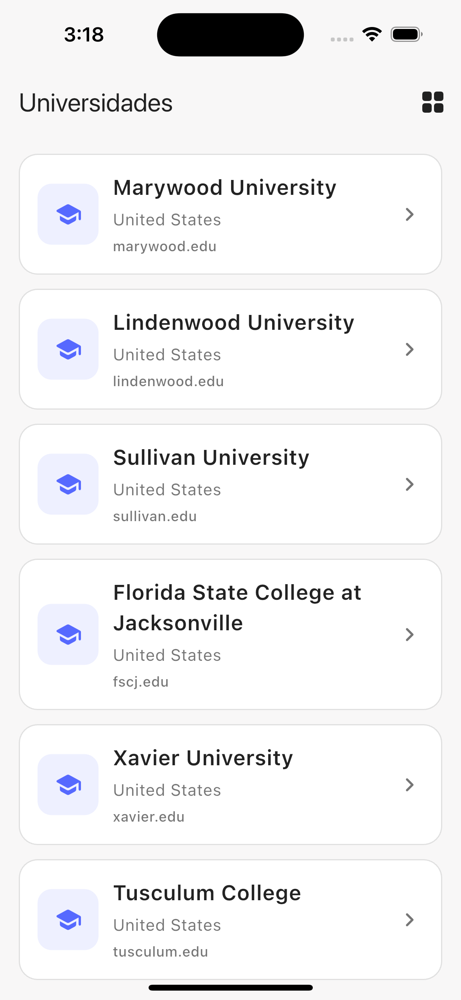
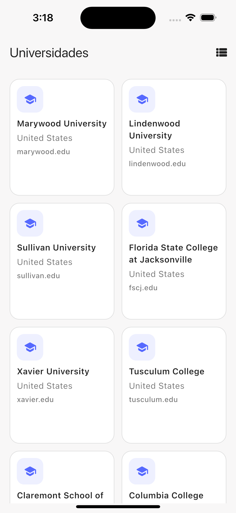
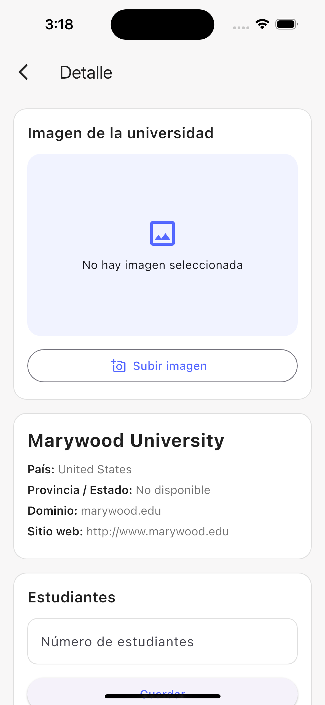
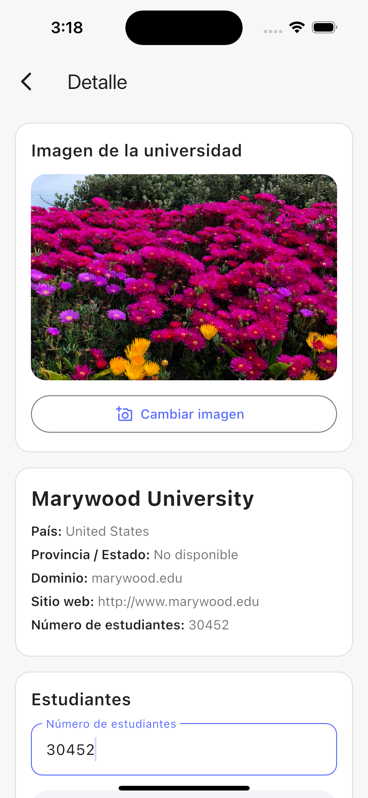
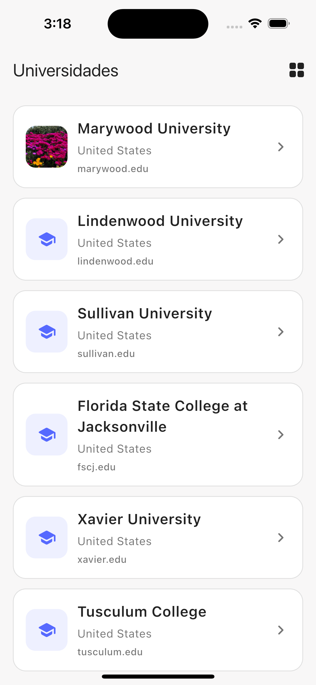
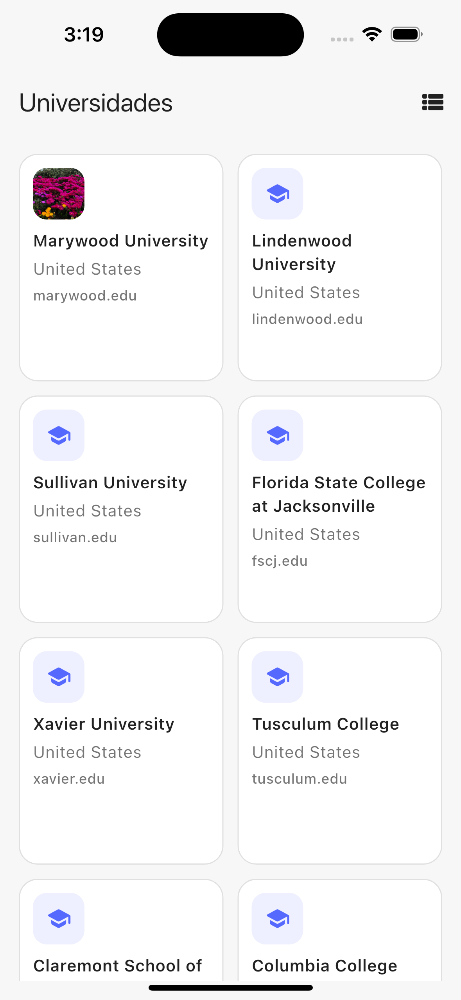

# Universities App

Aplicación móvil desarrollada en Flutter que permite visualizar un listado de universidades, ver su detalle y gestionar información adicional como imágenes y número de estudiantes

---

## Tecnologías utilizadas

- Flutter
- Dart
- Riverpod (gestión de estado)
- Dio (consumo de APIs)
- Formz (validación de formularios)
- go_router (navegación)

---

## Arquitectura

Se implementó una arquitectura basada en principios de **Clean Architecture**:

```bash
lib/
├── core/
│   ├── constants/      # Colores, spacing, sizes
│   ├── theme/          # Tema global
│   ├── network/        # Cliente Dio, configuración
│   └── routes/         # Configuración de navegación
├── features/
│   └── universities/
│       ├── domain/        # Entidades, repositorios, casos de uso
│       ├── infrastructure/# Datasource, modelos, repositorios
│       └── presentation/  # UI, estado, formularios


Se separaron responsabilidades entre capas para mantener el código escalable y testeable
```

---

## Funcionalidades

### Listado de universidades
- Visualización en **ListView y GridView**
- Infinite scroll sin librerías externas

### Detalle de universidad
- Información completa:
  - nombre
  - país
  - dominio
  - sitio web
- Campo para ingresar número de estudiantes
- Validación con Formz

### Gestión de imagen
- Subir imagen desde:
  - cámara
  - galería
- Persistencia en memoria durante la sesión
- Visualización en detalle y listado


### Pull to Refresh
- Recarga manual del listado

---

## Decisiones técnicas

- El endpoint no soporta paginación, por lo tanto:
  - Se implementó **infinite scroll en memoria**
  - Se carga el dataset completo y se renderiza por bloques

- Se utilizó **Riverpod** para:
  - Manejo de estado
  - Inyección de dependencias
  - Separación de lógica y UI

- Se utilizó **Formz** para:
  - Validación desacoplada del UI
  - Manejo de estado del formulario

---

## Testing

Se implementaron pruebas para garantizar calidad:

- Unit tests:
  - Validación de `StudentsInput`
  - Lógica del `UniversitiesNotifier`
- Widget tests:
  - Estados de carga y vacío en la UI

---

## Ejecución

1. Clonar el repositorio:

```bash
git clone <repo-url>
cd universities
```

<p align="center">
  
  
  
  
  
  
</p>